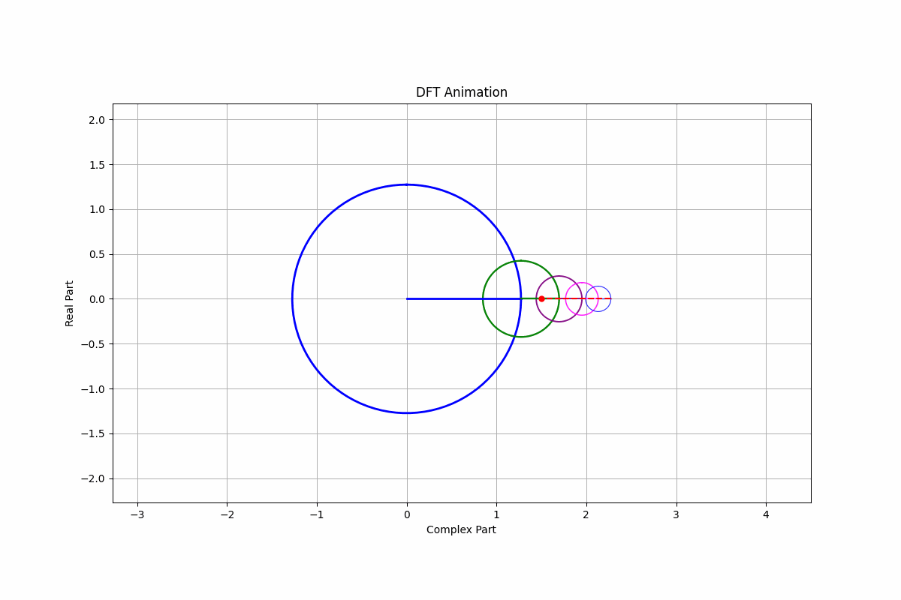
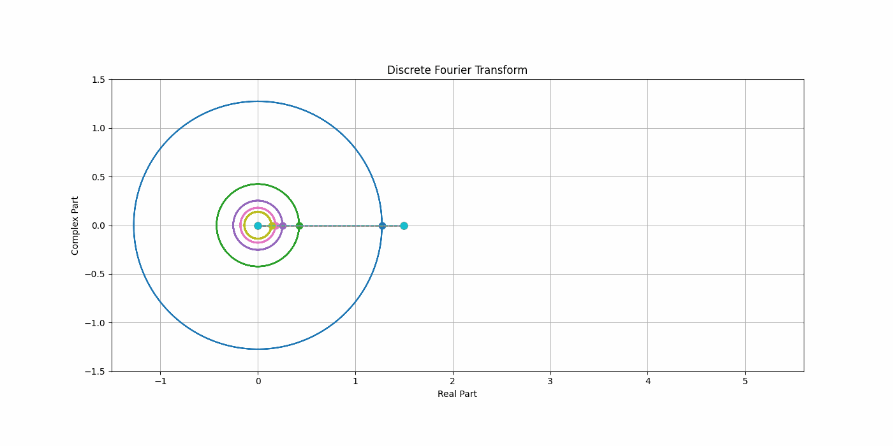

# waveletGPT

  
  
<em>Any function is an infinite sum of periodic sine waves</em>

  
  
<em>Any real function is an infinite sum of complex exponentials, or 'projection' of composition of rotating radius</em>

  
  
<em>Decomposed sine waves at various frequencies</em>

* Learn on Wavelet and Fourier Series (specifically discrete fourier transformation under complex domain), 3Brown1Blue and Wikipedia mainly. Superb visual demonstration from there. 
