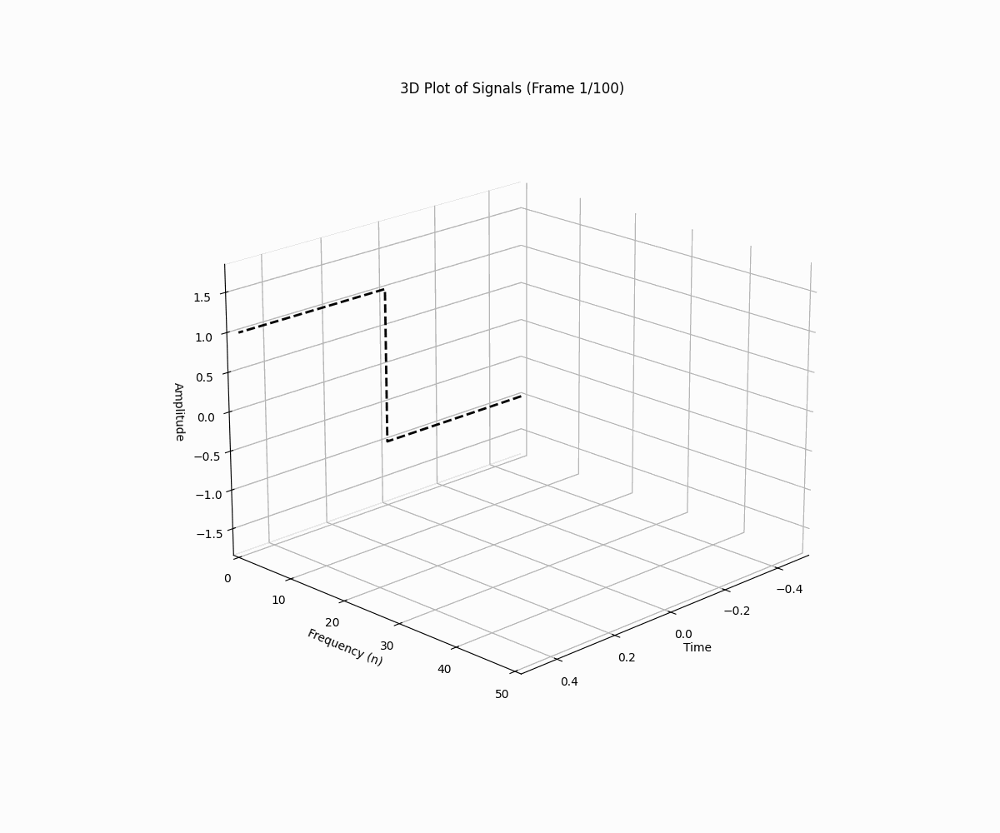

# waveletGPT
Experimental code for wavelet GPT and Fourier series expression

  
  
<em>Discrete Fourier Transformation</em>

  
  
<em>Discrete Fourier Transformation of Step Function</em>

  
  
<em>Fourier reconstruction convergence</em>

* Learn on Wavelet and Fourier Series (specifically discrete fourier transformation under complex domain), 3Brown1Blue and Wikipedia mainly. Superb visual demonstration from there. 
